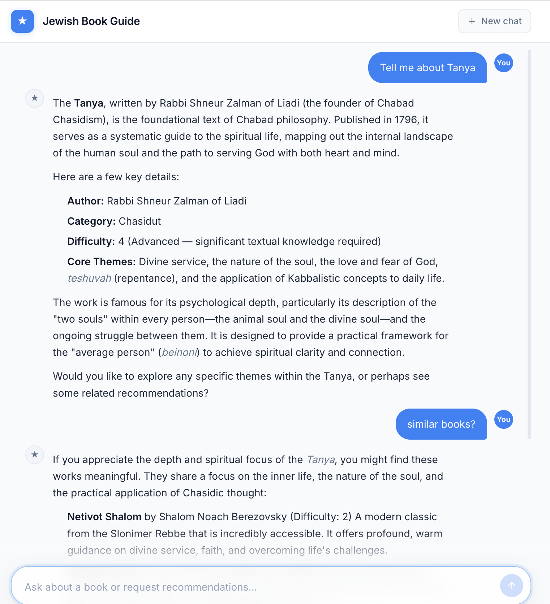

# jewish-book-guide

[](https://github.com/yourusername/jewish-books-guide/actions/workflows/ci.yml)

A conversational AI guide for Jewish books — recommends texts from the Chasidut, Musar, and Jewish Thought traditions based on what you've read and enjoyed.

Built as a portfolio project to demonstrate AI agent development with LangGraph, vector search, and MCP tool integration.



## What it does

- Maintains a curated collection of ~50 canonical Jewish texts ingested from the [Sefaria](https://www.sefaria.org) library API
- Generates vector embeddings (sentence-transformers) and stores them in PostgreSQL with [pgvector](https://github.com/pgvector/pgvector)
- Runs a **LangGraph ReAct agent** powered by Google Gemini that converses with users, calls tools to look up and recommend books, and fetches text passages directly from Sefaria
- Optionally integrates YouTube search via an MCP server to find lectures and shiurim related to any book

## Architecture

```
User
 │
 ▼
FastAPI server (agent/server.py)
 │   session state (in-memory)
 ▼
LangGraph ReAct agent (agent/graph.py)
 │   Google Gemini
 │   tool calls ──────────────────────────────────────────┐
 ▼                                                         │
Tools (agent/tools.py)                                     │
  lookup_book        → PostgreSQL (exact/fuzzy match)      │
  get_recommendations→ pgvector cosine sim + re-rank       │
  browse_collection  → PostgreSQL (filtered query)         │
  search_by_theme    → PostgreSQL (array search)           │
  get_sefaria_passage→ Sefaria REST API                    │
  youtube_search*    → YouTube MCP server (optional)  ◄───┘

Data pipeline (CLI):
  fetch_sefaria.py → Sefaria Index API → PostgreSQL
  embed.py         → sentence-transformers → pgvector
```

**Recommendation engine** (recommender/query.py) uses a two-stage approach:
1. Vector cosine similarity retrieves the top 20 candidates
2. Re-ranking applies weighted bonuses for category match, subcategory match, theme overlap, and difficulty alignment

## Setup

### Prerequisites
- Python 3.11+
- PostgreSQL with the [pgvector](https://github.com/pgvector/pgvector) extension
- A Google Gemini API key ([get one here](https://aistudio.google.com/))
- A YouTube Data API v3 key (optional, for YouTube search)

### Install

```bash
# Clone and install dependencies
git clone https://github.com/yourusername/jewish-books-guide
cd jewish-book-guide
python -m venv .venv && source .venv/bin/activate
pip install -e ".[dev]"

# Set up environment
cp .env.example .env
# Edit .env and fill in your API keys
```

### Database

A pre-populated database dump is included at `db/books.dump`. Restore it to get started immediately:

```bash
createdb books
pg_restore -d books db/books.dump
```

Or create the schema from scratch and re-ingest (see [Data pipeline](#data-pipeline) below):

```bash
createdb books
psql books < db/schema.sql
```

### Or use Docker

```bash
docker compose up -d
```

This starts PostgreSQL with pgvector pre-installed and the API server on port 8000.

## Data pipeline

The database dump already includes all book metadata and embeddings. You only need these commands if you want to rebuild from scratch or add new books:

```bash
# Ingest book metadata from Sefaria (~50 books, takes ~30s)
jewish-book-guide ingest

# Generate vector embeddings (downloads model on first run, ~100MB)
jewish-book-guide embed

# Verify
jewish-book-guide stats
```

## Usage

### Web UI

```bash
jewish-book-guide serve
# Open http://localhost:8000
```

Chat with the guide to get personalized book recommendations.

### CLI

```bash
# Search for a book
jewish-book-guide search Tanya

# Get recommendations similar to books you've read
jewish-book-guide recommend "Mesillat Yesharim" "Tanya" --difficulty 2 --category Musar

# Browse the collection
jewish-book-guide recommend "Kuzari" --top 8
```

## Project structure

```
agent/          LangGraph agent (graph, tools, prompts, FastAPI server)
ingestion/      Data pipeline (Sefaria fetch, embedding generation)
recommender/    Two-stage recommendation engine
db/             PostgreSQL schema
frontend/       Single-page chat UI (Tailwind CSS)
config/         Book enrichment data (difficulty, themes)
config.py       Central config (DB URL, model, re-ranking weights)
cli.py          Typer CLI entry point
```

## Stack

| Layer | Technology |
|-------|-----------|
| Agent framework | [LangGraph](https://github.com/langchain-ai/langgraph) |
| LLM | Google Gemini (via LangChain) |
| Vector DB | PostgreSQL + pgvector |
| Embeddings | sentence-transformers (all-MiniLM-L6-v2) |
| Web framework | FastAPI |
| Data source | Sefaria API |
| MCP integration | YouTube search (optional) |
